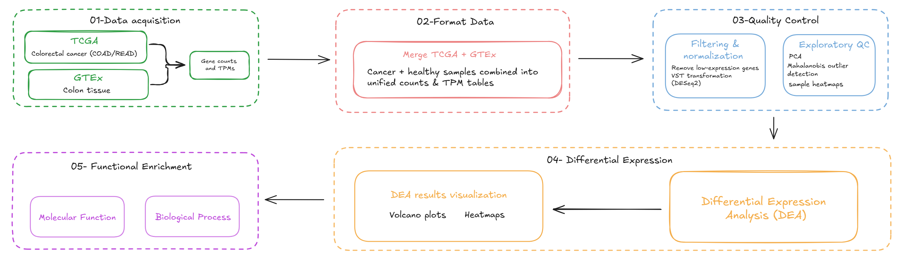

# Study overview

This study characterises the transcriptomic landscape of colorectal cancer (CRC) by comparing gene expression between tumour and healthy tissue using bulk RNA-seq data. Tumour samples were obtained from The Cancer Genome Atlas (TCGA), encompassing colon adenocarcinoma (TCGA-COAD) and rectal adenocarcinoma (TCGA-READ), while healthy colon tissue samples were sourced from the Genotype-Tissue Expression project (GTEx, v11), covering sigmoid colon and transverse colon sub-regions. The primary biological variable is disease status — tumour versus healthy — which defines the main axis of comparison throughout all analyses. The goal is to identify genes with significantly altered expression in colorectal tumours, and to characterise the biological processes and molecular functions disrupted in CRC, with potential implications for biomarker discovery and therapeutic targeting.

# Pipeline overview

{.lightbox fig-align="center" width="100%"}

# Differential Expression Analysis overview

Differential expression analysis was performed using the DESeq2 package (Love et al., 2014), which models RNA-seq count data using a negative binomial distribution to account for the overdispersion characteristic of high-throughput sequencing data. The design formula `~ disease_status` was specified, with healthy tissue as the reference level, so that all fold change estimates reflect the direction cancer versus healthy. Prior to analysis, genes with fewer than 10 counts in fewer than 3 samples were excluded to reduce noise from lowly expressed genes. Raw, unstranded counts (STAR – Counts workflow) were used as input, as required by DESeq2; variance-stabilised (`VST`, `blind = TRUE`) counts were used solely for QC visualisation. To obtain more reliable fold change estimates — particularly for genes with low counts, which tend to exhibit inflated log2FC values — results were subjected to log2 fold change shrinkage using the `lfcShrink()` function with the `apeglm` method (Zhu et al., 2019). A gene was considered differentially expressed if it met a statistical threshold (adjusted p-value < 0.05, Benjamini-Hochberg FDR correction).

# Setup and Load data

```{r}
#| label: setup
#| include: false

library(readr)
library(dplyr)
library(tibble)
library(stringr)
library(ggplot2)
library(magrittr)
library(clusterProfiler)
library(org.Hs.eg.db)
library(enrichplot)
library(msigdbr)

# Load data
de_results <- readRDS("../data/processed/de_results.rds")
pca_results <- readRDS("../data/processed/pca_results.rds")

```

# Get genes of interest

From the differential expression results, three gene sets were defined based on the magnitude and direction of expression change. Genes with \|log2FC\| \> 4 were selected as a high-confidence set of strongly deregulated genes and used in the combined (up- and down-regulated) enrichment analysis. Up-regulated genes (log2FC \> 2) and down-regulated genes (log2FC \< -2) were extracted separately to allow direction-specific pathway interpretation. For each set, a named vector of log2FC values was created to annotate enrichment visualisations with expression magnitude. Additionally, genes driving PC1 and PC2 were extracted from the PCA rotation matrix. Because Ensembl gene identifiers carry version suffixes (e.g., ENSG00000001.15), these were stripped prior to any annotation lookup. For each component, the top 5% of genes from each tail of the loading distribution were selected using the 95th and 5th percentiles respectively, ensuring exactly 5% of genes per tail regardless of distributional asymmetry. Genes with positive PC1 loadings contribute to the healthy end of PC1, while genes with negative PC1 loadings define the tumour transcriptional signature. These sets were analysed independently to characterise the biological identity of each condition.

```{r}
# Translate ENSEMBL vector names to gene symbols so they match the readable gene IDs stored in enrichGO(readable = TRUE) results
fc_to_symbol <- function(fc) {
  sym_list <- AnnotationDbi::mapIds(org.Hs.eg.db, keys = names(fc),
                                    column = "SYMBOL", keytype = "ENSEMBL",
                                    multiVals = "list")
  ens    <- rep(names(sym_list), lengths(sym_list))
  syms   <- unlist(sym_list, use.names = FALSE)
  ok     <- !is.na(syms)
  fc_sym <- setNames(fc[ens[ok]], syms[ok])
  out    <- c(fc, fc_sym)
  out[!duplicated(names(out))]
}

# Create a list to save the enrichment analysis results
fun_enrich <- list()

# Up regulated genes
fun_enrich$de_genes_up <-
  de_results$sig |>
  dplyr::select(gene_id, log2FoldChange) |>
  dplyr::filter(log2FoldChange > 2) |>
  dplyr::arrange(dplyr::desc(log2FoldChange))

# Named fold change vector for upregulated genes
fc_vector_up <- fc_to_symbol(tibble::deframe(fun_enrich$de_genes_up))

# Down regulated genes
fun_enrich$de_genes_down <-
  de_results$sig |>
  dplyr::select(gene_id, log2FoldChange) |>
  dplyr::filter(log2FoldChange < -2) |>
  dplyr::arrange(dplyr::desc(log2FoldChange))

# Named fold change vector for downregulated genes
fc_vector_down <- fc_to_symbol(tibble::deframe(fun_enrich$de_genes_down))

# Extract PCA loadings for PC1 and PC2
pca_loadings <- pca_results$pca_vst$rotation |>
  tibble::as_tibble(rownames = "gene_id") |>
  dplyr::mutate(gene_id = stringr::str_remove(gene_id, "\\.\\d+$")) |>
  dplyr::select(gene_id, PC1, PC2)

# Named vector of PC1 loadings (used in cnetplot and heatplot)
fc_vector_pc1 <- fc_to_symbol(tibble::deframe(
  pca_loadings |>
  dplyr::select(gene_id, PC1) |>
  dplyr::arrange(dplyr::desc(PC1))))

# Named vector of PC2 loadings
fc_vector_pc2 <- fc_to_symbol(tibble::deframe(
  pca_loadings |>
  dplyr::select(gene_id, PC2) |>
  dplyr::arrange(dplyr::desc(PC2))))

# Define separate thresholds for each tail of PC1
threshold_pc1_pos <- quantile(pca_loadings$PC1, 0.95)
threshold_pc1_neg <- quantile(pca_loadings$PC1, 0.05)

# Top 5% genes with positive PC1 loadings
pca_genes_pc1_pos <- pca_loadings |>
  dplyr::filter(PC1 > threshold_pc1_pos) |>
  dplyr::pull(gene_id)

# Top 5% genes with negative PC1 loadings
pca_genes_pc1_neg <- pca_loadings |>
  dplyr::filter(PC1 < threshold_pc1_neg) |>
  dplyr::pull(gene_id)

# Define separate thresholds for each tail of PC2
threshold_pc2_pos <- quantile(pca_loadings$PC2, 0.95)
threshold_pc2_neg <- quantile(pca_loadings$PC2, 0.05)

# Top 5% genes with positive PC2 loadings
pca_genes_pc2_pos <- pca_loadings |>
  dplyr::filter(PC2 > threshold_pc2_pos) |>
  dplyr::pull(gene_id)

# Top 5% genes with negative PC2 loadings
pca_genes_pc2_neg <- pca_loadings |>
  dplyr::filter(PC2 < threshold_pc2_neg) |>
  dplyr::pull(gene_id)

```

# Functional Enrichment

Gene Ontology (GO) is a structured, hierarchical vocabulary that classifies gene products according to three orthogonal aspects: Biological Process (BP), which describes coordinated programmes of molecular events; Molecular Function (MF), which captures biochemical activities at the gene product level; and Cellular Component (CC), which denotes subcellular localisation. Over-Representation Analysis (ORA) tests whether a given gene set contains more genes annotated to a particular GO term than expected by chance, using the hypergeometric test with Benjamini-Hochberg FDR correction. Here, `clusterProfiler::enrichGO()` was applied separately for the BP and MF ontologies, with a p-value cutoff of 0.05 and a q-value cutoff of 0.10. The background gene set (universe) was defined as all genes retained after low-expression filtering and tested in the differential expression analysis (`rownames(de_results$shrunk)`) for the DE-based gene sets, and as all genes present in the PCA rotation matrix (`pca_loadings$gene_id`) for the loading-based gene sets — ensuring each test uses the appropriate statistical background. Results are visualised using `dotplots`, `heatplots`, enrichment maps (`emapplot`), and gene-concept networks (`cnetplot`).

## GO Biological Process Ontology

```{r}
#
## Up regulated genes
#

fun_enrich$ego_up <- clusterProfiler::enrichGO(
  gene          = fun_enrich$de_genes_up$gene_id,   # Genes of interest
  universe      = rownames(de_results$shrunk),      # Background gene set
  OrgDb         = org.Hs.eg.db,                     # Annotation database
  keyType       = "ENSEMBL",                        # Key type for gene identifiers
  readable      = TRUE,                             # Convert gene IDs to gene names
  ont           = "BP",                             # Ontology: can be "BP", "MF", "CC", or "ALL"
  pvalueCutoff  = 0.05,                             # P-value cutoff for significance
  qvalueCutoff  = 0.10                              # Q-value cutoff for significance
)

fun_enrich$dotplot_up <-
  enrichplot::dotplot(
    fun_enrich$ego_up,
    showCategory = 20,
    title = "GO BP | Dotplot | Upregulated genes") +
  ggplot2::theme(
    axis.text.y = ggplot2::element_text(size = 7)
  )

fun_enrich$heatplot_up <-
  enrichplot::heatplot(
    fun_enrich$ego_up,
    showCategory = 10,
    foldChange = fc_vector_up) +
  ggplot2::ggtitle("GO BP | Enrichment heatplot | Upregulated genes") +
  ggplot2::theme(
    axis.text.y = ggplot2::element_text(size = 9),
    axis.text.x = ggplot2::element_text(size = 5, hjust = 1, angle = 90)
  )

fun_enrich$emapplot_up <-
  enrichplot::emapplot(
    enrichplot::pairwise_termsim(fun_enrich$ego_up),
    showCategory = 15,
    layout = "nicely") +
  ggplot2::ggtitle("GO BP | Enrichment Map | Upregulated genes")

fun_enrich$cnetplot_up <-
  enrichplot::cnetplot(
    fun_enrich$ego_up,
    showCategory = 7,
    layout = "nicely",
    foldChange = fc_vector_up) +
  ggplot2::ggtitle("GO BP | Gene-Concept Network | Upregulated genes") +
  ggplot2::theme(plot.title = ggplot2::element_text(hjust = 0.5))

#
## Down regulated genes
#

fun_enrich$ego_down <- clusterProfiler::enrichGO(
  gene          = fun_enrich$de_genes_down$gene_id,
  universe      = rownames(de_results$shrunk),
  OrgDb         = org.Hs.eg.db,
  keyType       = "ENSEMBL",
  readable      = TRUE,
  ont           = "BP",
  pvalueCutoff  = 0.05,
  qvalueCutoff  = 0.10
)

fun_enrich$dotplot_down <-
  enrichplot::dotplot(
    fun_enrich$ego_down,
    showCategory = 20,
    title = "GO BP | Dotplot | Downregulated genes") +
  ggplot2::theme(
    axis.text.y = ggplot2::element_text(size = 7.5)
  )

fun_enrich$heatplot_down <-
  enrichplot::heatplot(
    fun_enrich$ego_down,
    showCategory = 10,
    foldChange = fc_vector_down) +
  ggplot2::ggtitle("GO BP | Enrichment heatplot | Downregulated genes") +
  ggplot2::theme(
    axis.text.y = ggplot2::element_text(size = 8),
    axis.text.x = ggplot2::element_text(size = 3, hjust = 1, angle = 90)
  )

fun_enrich$emapplot_down <-
  enrichplot::emapplot(
    enrichplot::pairwise_termsim(fun_enrich$ego_down),
    showCategory = 15,
    layout = "nicely") +
  ggplot2::ggtitle("GO BP | Enrichment Map | Downregulated genes")

fun_enrich$cnetplot_down <-
  enrichplot::cnetplot(
    fun_enrich$ego_down,
    showCategory = 7,
    layout = "nicely",
    foldChange = fc_vector_down) +
  ggplot2::ggtitle("GO BP | Gene-Concept Network | Downregulated genes") +
  ggplot2::theme(plot.title = ggplot2::element_text(hjust = 0.5))

#
## PC1 positive loadings
#

fun_enrich$ego_pc1_pos <- clusterProfiler::enrichGO(
  gene          = pca_genes_pc1_pos,
  universe      = pca_loadings$gene_id,
  OrgDb         = org.Hs.eg.db,
  keyType       = "ENSEMBL",
  readable      = TRUE,
  ont           = "BP",
  pvalueCutoff  = 0.05,
  qvalueCutoff  = 0.10
)

fun_enrich$dotplot_pc1_pos <-
  enrichplot::dotplot(
    fun_enrich$ego_pc1_pos,
    showCategory = 20) +
  ggplot2::ggtitle("GO BP | Dotplot | PC1 positive loadings") +
  ggplot2::theme(
    axis.text.y = ggplot2::element_text(size = 7.5)
  )

fun_enrich$heatplot_pc1_pos <-
  enrichplot::heatplot(
    fun_enrich$ego_pc1_pos,
    showCategory = 10,
    foldChange = fc_vector_pc1) +
  ggplot2::ggtitle("GO BP | Heatplot | PC1 positive loadings") +
  ggplot2::theme(
    axis.text.y = ggplot2::element_text(size = 7.5),
    axis.text.x = ggplot2::element_text(size = 2.5, hjust = 1, angle = 90)
  )

fun_enrich$emapplot_pc1_pos <-
  enrichplot::emapplot(
    enrichplot::pairwise_termsim(fun_enrich$ego_pc1_pos),
    showCategory = 15,
    layout = "nicely") +
  ggplot2::ggtitle("GO BP | Enrichment Map | PC1 positive loadings")

fun_enrich$cnetplot_pc1_pos <-
  enrichplot::cnetplot(
    fun_enrich$ego_pc1_pos,
    showCategory = 5,
    layout       = "nicely",
    foldChange   = fc_vector_pc1) +
  ggplot2::ggtitle("GO BP | Gene-Concept Network | PC1 positive loadings") +
  ggplot2::theme(plot.title = ggplot2::element_text(hjust = 0.5))

#
## PC1 negative loadings
#

fun_enrich$ego_pc1_neg <- clusterProfiler::enrichGO(
  gene          = pca_genes_pc1_neg,
  universe      = pca_loadings$gene_id,
  OrgDb         = org.Hs.eg.db,
  keyType       = "ENSEMBL",
  readable      = TRUE,
  ont           = "BP",
  pvalueCutoff  = 0.05,
  qvalueCutoff  = 0.10
)

fun_enrich$dotplot_pc1_neg <-
  enrichplot::dotplot(
    fun_enrich$ego_pc1_neg,
    showCategory = 20) +
  ggplot2::ggtitle("GO BP | Dotplot | PC1 negative loadings") +
  ggplot2::theme(
    axis.text.y = ggplot2::element_text(size = 4.5)
  )

fun_enrich$heatplot_pc1_neg <-
  enrichplot::heatplot(
    fun_enrich$ego_pc1_neg,
    showCategory = 10,
    foldChange = fc_vector_pc1) +
  ggplot2::ggtitle("GO BP | Heatplot | PC1 negative loadings") +
  ggplot2::theme(
    axis.text.y = ggplot2::element_text(size = 9),
    axis.text.x = ggplot2::element_text(size = 5.5, hjust = 1, angle = 90)
  )

fun_enrich$emapplot_pc1_neg <-
  enrichplot::emapplot(
    enrichplot::pairwise_termsim(fun_enrich$ego_pc1_neg),
    showCategory = 15,
    layout = "nicely") +
  ggplot2::ggtitle("GO BP | Enrichment Map | PC1 negative loadings")

fun_enrich$cnetplot_pc1_neg <-
  enrichplot::cnetplot(
    fun_enrich$ego_pc1_neg,
    showCategory = 5,
    layout       = "nicely",
    foldChange   = fc_vector_pc1) +
  ggplot2::ggtitle("GO BP | Gene-Concept Network | PC1 negative loadings") +
  ggplot2::theme(plot.title = ggplot2::element_text(hjust = 0.5))

#
## Positive PC2 loadings
#

fun_enrich$ego_pc2_pos <- clusterProfiler::enrichGO(
  gene         = pca_genes_pc2_pos,
  universe     = pca_loadings$gene_id,
  OrgDb        = org.Hs.eg.db,
  keyType      = "ENSEMBL",
  readable     = TRUE,
  ont          = "BP",
  pvalueCutoff = 0.05,
  qvalueCutoff = 0.10
)

fun_enrich$dotplot_pc2_pos <-
  enrichplot::dotplot(
    fun_enrich$ego_pc2_pos,
    showCategory = 20) +
  ggplot2::ggtitle("GO BP | Dotplot | PC2 positive loadings") +
  ggplot2::theme(axis.text.y = ggplot2::element_text(size = 7.5))

fun_enrich$heatplot_pc2_pos <-
  enrichplot::heatplot(
    fun_enrich$ego_pc2_pos,
    showCategory = 10,
    foldChange   = fc_vector_pc2) +
  ggplot2::ggtitle("GO BP | Heatplot | PC2 positive loadings") +
  ggplot2::theme(
    axis.text.y = ggplot2::element_text(size = 7.5),
    axis.text.x = ggplot2::element_text(size = 5, hjust = 1, angle = 90)
  )

fun_enrich$emapplot_pc2_pos <-
  enrichplot::emapplot(
    enrichplot::pairwise_termsim(fun_enrich$ego_pc2_pos),
    showCategory = 15,
    layout       = "nicely") +
  ggplot2::ggtitle("GO BP | Enrichment Map | PC2 positive loadings")

fun_enrich$cnetplot_pc2_pos <-
  enrichplot::cnetplot(
    fun_enrich$ego_pc2_pos,
    showCategory = 5,
    layout       = "nicely",
    foldChange   = fc_vector_pc2) +
  ggplot2::ggtitle("GO BP | Gene-Concept Network | PC2 positive loadings") +
  ggplot2::theme(plot.title = ggplot2::element_text(hjust = 0.5))

#
## Negative PC2 loadings
#

fun_enrich$ego_pc2_neg <- clusterProfiler::enrichGO(
  gene         = pca_genes_pc2_neg,
  universe     = pca_loadings$gene_id,
  OrgDb        = org.Hs.eg.db,
  keyType      = "ENSEMBL",
  readable     = TRUE,
  ont          = "BP",
  pvalueCutoff = 0.05,
  qvalueCutoff = 0.10
)

fun_enrich$dotplot_pc2_neg <-
  enrichplot::dotplot(
    fun_enrich$ego_pc2_neg,
    showCategory = 20) +
  ggplot2::ggtitle("GO BP | Dotplot | PC2 negative loadings") +
  ggplot2::theme(axis.text.y = ggplot2::element_text(size = 4.5))

fun_enrich$heatplot_pc2_neg <-
  enrichplot::heatplot(
    fun_enrich$ego_pc2_neg,
    showCategory = 10,
    foldChange   = fc_vector_pc2) +
  ggplot2::ggtitle("GO BP | Heatplot | PC2 negative loadings") +
  ggplot2::theme(
    axis.text.y = ggplot2::element_text(size = 7),
    axis.text.x = ggplot2::element_text(size = 6, hjust = 1, angle = 90)
  )

fun_enrich$emapplot_pc2_neg <-
  enrichplot::emapplot(
    enrichplot::pairwise_termsim(fun_enrich$ego_pc2_neg),
    showCategory = 15,
    layout       = "nicely") +
  ggplot2::ggtitle("GO BP | Enrichment Map | PC2 negative loadings")

fun_enrich$cnetplot_pc2_neg <-
  enrichplot::cnetplot(
    fun_enrich$ego_pc2_neg,
    showCategory = 5,
    layout       = "nicely",
    foldChange   = fc_vector_pc2) +
  ggplot2::ggtitle("GO BP | Gene-Concept Network | PC2 negative loadings") +
  ggplot2::theme(plot.title = ggplot2::element_text(hjust = 0.5))

```

### Up- and Down-regulated genes \| Dotplot comparison

```{r}
#| lightbox:
#|   group: "up-down-regulated-genes-bp"

patchwork::wrap_plots(
  fun_enrich$dotplot_up,
  fun_enrich$dotplot_down,
  ncol = 2)

```

### Up-regulated genes

```{r}
#| lightbox:
#|   group: "up-regulated-genes-bp"

fun_enrich$heatplot_up
fun_enrich$emapplot_up
fun_enrich$cnetplot_up

```

### Down-regulated genes

```{r}
#| lightbox:
#|   group: "down-regulated-genes-bp"

fun_enrich$heatplot_down
fun_enrich$emapplot_down
fun_enrich$cnetplot_down

```

### PC1 loadings

In PCA, loadings represent the weight of each gene in the linear combination that defines a given principal component: genes with large absolute loadings are the primary drivers of sample separation along that axis and therefore carry direct biological meaning beyond what classical differential expression alone can capture. In this dataset, PC1 explains 46% of total variance and separates samples by disease status: positive PC1 scores correspond to healthy samples, while negative PC1 scores correspond to tumour samples. Accordingly, genes with high positive loadings define the transcriptional identity of healthy colorectal tissue, whereas genes with strongly negative loadings characterise the tumour state. The top 5% of genes from each tail of the PC1 loading distribution were selected using the 95th and 5th percentiles respectively, ensuring exactly 5% of genes per tail regardless of distributional asymmetry, and analysed independently to identify the biological processes and molecular functions that most distinguish each condition.

```{r}
#| lightbox:
#|   group: "pc1-loadings-bp"

patchwork::wrap_plots(
  fun_enrich$dotplot_pc1_pos,
  fun_enrich$dotplot_pc1_neg,
  ncol = 2)

```

#### Positive loadings

Genes with positive PC1 loadings are the primary transcriptional drivers of the healthy colorectal tissue signature.

```{r}
#| lightbox:
#|   group: "pc1-positive-loadings-bp"

fun_enrich$heatplot_pc1_pos
fun_enrich$emapplot_pc1_pos
fun_enrich$cnetplot_pc1_pos

```

#### Negative loadings

Genes with negative PC1 loadings are the primary transcriptional drivers of the tumour signature.

```{r}
#| lightbox:
#|   group: "pc1-negative-loadings-bp"

fun_enrich$heatplot_pc1_neg
fun_enrich$emapplot_pc1_neg
fun_enrich$cnetplot_pc1_neg

```

### PC2 loadings

PC2 explains 12% of total variance and captures a second, orthogonal axis of biological variation independent of disease status. The same gene selection strategy was applied: the top 5% of genes from each tail of the PC2 loading distribution were selected using the 95th and 5th percentiles respectively and analysed independently to characterise the biological processes and molecular functions associated with each pole of this component.

```{r}
#| lightbox:
#|   group: "pc2-loadings-bp"

patchwork::wrap_plots(
  fun_enrich$dotplot_pc2_pos,
  fun_enrich$dotplot_pc2_neg,
  ncol = 2)

```

#### Positive loadings

```{r}
#| lightbox:
#|   group: "pc2-positive-loadings-bp"

fun_enrich$heatplot_pc2_pos
fun_enrich$emapplot_pc2_pos
fun_enrich$cnetplot_pc2_pos

```

#### Negative loadings

```{r}
#| lightbox:
#|   group: "pc2-negative-loadings-bp"

fun_enrich$heatplot_pc2_neg
fun_enrich$emapplot_pc2_neg
fun_enrich$cnetplot_pc2_neg

```

## GO Molecular Function Ontology

While the Biological Process ontology captures coordinated cellular programmes, the Molecular Function ontology describes what individual gene products do at the biochemical level — enzyme activity, receptor binding, ion channel function, and so on. Together, the two ontologies provide complementary perspectives: BP reveals which biological pathways are disrupted in CRC, while MF identifies the specific molecular activities that underlie those disruptions. The same `enrichGO()` configuration was applied: p-value cutoff of 0.05, q-value cutoff of 0.10, and `keyType = "ENSEMBL"`. The analysis was run independently for each of the five gene sets defined above (all DE genes, up-regulated, down-regulated, PC1 positive loadings, and PC1 negative loadings), using the same universe definitions as in the BP analysis. To reduce semantic redundancy among enriched terms — a common issue in MF enrichment due to the hierarchical structure of GO — results were further simplified using `clusterProfiler::simplify()` with a semantic similarity cutoff of 0.7 (Wang method, selecting the term with lowest adjusted p-value per redundant cluster). All visualisations for the MF ontology use the simplified results.

```{r}
#
## Up-regulated genes
#

fun_enrich$ego_up_mf <- clusterProfiler::enrichGO(
  gene          = fun_enrich$de_genes_up$gene_id,
  universe      = rownames(de_results$shrunk),
  OrgDb         = org.Hs.eg.db,
  keyType       = "ENSEMBL",
  readable      = TRUE,
  ont           = "MF",
  pvalueCutoff  = 0.05,
  qvalueCutoff  = 0.10
)

fun_enrich$ego_up_mf_simple <- clusterProfiler::simplify(
  fun_enrich$ego_up_mf,
  cutoff        = 0.7,
  by            = "p.adjust",
  select_fun    = min,
  measure       = "Wang",
  semData       = NULL
)

fun_enrich$dotplot_up_mf <-
  enrichplot::dotplot(
    fun_enrich$ego_up_mf_simple,
    showCategory = 20,
    title = "GO MF | Dotplot | Upregulated genes") +
  ggplot2::theme(axis.text.y = ggplot2::element_text(size = 7))

fun_enrich$heatplot_up_mf <-
  enrichplot::heatplot(
    fun_enrich$ego_up_mf_simple,
    showCategory = 10,
    foldChange = fc_vector_up) +
  ggplot2::ggtitle("GO MF | Enrichment heatplot | Upregulated genes") +
  ggplot2::theme(
    axis.text.y = ggplot2::element_text(size = 7),
    axis.text.x = ggplot2::element_text(size = 3.5, hjust = 1, angle = 90)
  )

fun_enrich$emapplot_up_mf <-
  enrichplot::emapplot(
    enrichplot::pairwise_termsim(fun_enrich$ego_up_mf_simple),
    showCategory = 15,
    layout = "nicely") +
  ggplot2::ggtitle("GO MF | Enrichment Map | Upregulated genes")

fun_enrich$cnetplot_up_mf <-
  enrichplot::cnetplot(
    fun_enrich$ego_up_mf_simple,
    showCategory = 7,
    layout = "kk",
    foldChange = fc_vector_up) +
  ggplot2::ggtitle("GO MF | Gene-Concept Network | Upregulated genes") +
  ggplot2::theme(plot.title = ggplot2::element_text(hjust = 0.5))

#
## Down-regulated genes
#

fun_enrich$ego_down_mf <- clusterProfiler::enrichGO(
  gene          = fun_enrich$de_genes_down$gene_id,
  universe      = rownames(de_results$shrunk),
  OrgDb         = org.Hs.eg.db,
  keyType       = "ENSEMBL",
  readable      = TRUE,
  ont           = "MF",
  pvalueCutoff  = 0.05,
  qvalueCutoff  = 0.10
)

fun_enrich$ego_down_mf_simple <- clusterProfiler::simplify(
  fun_enrich$ego_down_mf,
  cutoff        = 0.7,
  by            = "p.adjust",
  select_fun    = min,
  measure       = "Wang",
  semData       = NULL
)

fun_enrich$dotplot_down_mf <-
  enrichplot::dotplot(
    fun_enrich$ego_down_mf_simple,
    showCategory = 20,
    title = "GO MF | Dotplot | Downregulated genes") +
  ggplot2::theme(axis.text.y = ggplot2::element_text(size = 4.5))

fun_enrich$heatplot_down_mf <-
  enrichplot::heatplot(
    fun_enrich$ego_down_mf_simple,
    showCategory = 10,
    foldChange = fc_vector_down) +
  ggplot2::ggtitle("GO MF | Enrichment heatplot | Downregulated genes") +
  ggplot2::theme(
    axis.text.y = ggplot2::element_text(size = 8),
    axis.text.x = ggplot2::element_text(size = 3, hjust = 1, angle = 90)
  )

fun_enrich$emapplot_down_mf <-
  enrichplot::emapplot(
    enrichplot::pairwise_termsim(fun_enrich$ego_down_mf_simple),
    showCategory = 15,
    layout = "nicely") +
  ggplot2::ggtitle("GO MF | Enrichment Map | Downregulated genes")

fun_enrich$cnetplot_down_mf <-
  enrichplot::cnetplot(
    fun_enrich$ego_down_mf_simple,
    showCategory = 7,
    layout = "kk",
    foldChange = fc_vector_down) +
  ggplot2::ggtitle("GO MF | Gene-Concept Network | Downregulated genes") +
  ggplot2::theme(plot.title = ggplot2::element_text(hjust = 0.5))

#
## PC1 positive loadings
#

fun_enrich$ego_pc1_pos_mf <- clusterProfiler::enrichGO(
  gene          = pca_genes_pc1_pos,
  universe      = pca_loadings$gene_id,
  OrgDb         = org.Hs.eg.db,
  keyType       = "ENSEMBL",
  readable      = TRUE,
  ont           = "MF",
  pvalueCutoff  = 0.05,
  qvalueCutoff  = 0.10
)

fun_enrich$ego_pc1_pos_mf_simple <- clusterProfiler::simplify(
  fun_enrich$ego_pc1_pos_mf,
  cutoff        = 0.7,
  by            = "p.adjust",
  select_fun    = min,
  measure       = "Wang",
  semData       = NULL
)

fun_enrich$dotplot_pc1_pos_mf <-
  enrichplot::dotplot(
    fun_enrich$ego_pc1_pos_mf_simple,
    showCategory = 20) +
  ggplot2::ggtitle("GO MF | Dotplot | PC1 positive loadings") +
  ggplot2::theme(axis.text.y = ggplot2::element_text(size = 7.5))

fun_enrich$heatplot_pc1_pos_mf <-
  enrichplot::heatplot(
    fun_enrich$ego_pc1_pos_mf_simple,
    showCategory = 10,
    foldChange = fc_vector_pc1) +
  ggplot2::ggtitle("GO MF | Heatplot | PC1 positive loadings") +
  ggplot2::theme(
    axis.text.y = ggplot2::element_text(size = 7.5),
    axis.text.x = ggplot2::element_text(size = 5, hjust = 1, angle = 90)
  )

fun_enrich$emapplot_pc1_pos_mf <-
  enrichplot::emapplot(
    enrichplot::pairwise_termsim(fun_enrich$ego_pc1_pos_mf_simple),
    showCategory = 15,
    layout = "nicely") +
  ggplot2::ggtitle("GO MF | Enrichment Map | PC1 positive loadings")

fun_enrich$cnetplot_pc1_pos_mf <-
  enrichplot::cnetplot(
    fun_enrich$ego_pc1_pos_mf_simple,
    showCategory = 5,
    layout = "nicely",
    foldChange = fc_vector_pc1) +
  ggplot2::ggtitle("GO MF | Gene-Concept Network | PC1 positive loadings") +
  ggplot2::theme(plot.title = ggplot2::element_text(hjust = 0.5))

#
## PC1 negative loadings
#

fun_enrich$ego_pc1_neg_mf <- clusterProfiler::enrichGO(
  gene          = pca_genes_pc1_neg,
  universe      = pca_loadings$gene_id,
  OrgDb         = org.Hs.eg.db,
  keyType       = "ENSEMBL",
  readable      = TRUE,
  ont           = "MF",
  pvalueCutoff  = 0.05,
  qvalueCutoff  = 0.10
)

fun_enrich$ego_pc1_neg_mf_simple <- clusterProfiler::simplify(
  fun_enrich$ego_pc1_neg_mf,
  cutoff        = 0.7,
  by            = "p.adjust",
  select_fun    = min,
  measure       = "Wang",
  semData       = NULL
)

fun_enrich$dotplot_pc1_neg_mf <-
  enrichplot::dotplot(
    fun_enrich$ego_pc1_neg_mf_simple,
    showCategory = 20) +
  ggplot2::ggtitle("GO MF | Dotplot | PC1 negative loadings") +
  ggplot2::theme(axis.text.y = ggplot2::element_text(size = 6.5))

fun_enrich$heatplot_pc1_neg_mf <-
  enrichplot::heatplot(
    fun_enrich$ego_pc1_neg_mf_simple,
    showCategory = 10,
    foldChange = fc_vector_pc1) +
  ggplot2::ggtitle("GO MF | Heatplot | PC1 negative loadings") +
  ggplot2::theme(
    axis.text.y = ggplot2::element_text(size = 9),
    axis.text.x = ggplot2::element_text(size = 6.5, hjust = 1, angle = 90)
  )

fun_enrich$emapplot_pc1_neg_mf <-
  enrichplot::emapplot(
    enrichplot::pairwise_termsim(fun_enrich$ego_pc1_neg_mf_simple),
    showCategory = 15,
    layout = "nicely") +
  ggplot2::ggtitle("GO MF | Enrichment Map | PC1 negative loadings")

fun_enrich$cnetplot_pc1_neg_mf <-
  enrichplot::cnetplot(
    fun_enrich$ego_pc1_neg_mf_simple,
    showCategory = 5,
    layout = "nicely",
    foldChange = fc_vector_pc1) +
  ggplot2::ggtitle("GO MF | Gene-Concept Network | PC1 negative loadings") +
  ggplot2::theme(plot.title = ggplot2::element_text(hjust = 0.5))

#
## Positive PC2 loadings
#
fun_enrich$ego_pc2_pos_mf <- clusterProfiler::enrichGO(
  gene         = pca_genes_pc2_pos,
  universe     = pca_loadings$gene_id,
  OrgDb        = org.Hs.eg.db,
  keyType      = "ENSEMBL",
  readable     = TRUE,
  ont          = "MF",
  pvalueCutoff = 0.05,
  qvalueCutoff = 0.10
)

fun_enrich$ego_pc2_pos_mf_simple <- clusterProfiler::simplify(
  fun_enrich$ego_pc2_pos_mf,
  cutoff     = 0.7,
  by         = "p.adjust",
  select_fun = min,
  measure    = "Wang",
  semData    = NULL
)

fun_enrich$dotplot_pc2_pos_mf <-
  enrichplot::dotplot(
    fun_enrich$ego_pc2_pos_mf_simple,
    showCategory = 20) +
  ggplot2::ggtitle("GO MF | Dotplot | PC2 positive loadings") +
  ggplot2::theme(axis.text.y = ggplot2::element_text(size = 9)) +
  ggplot2::theme(axis.text.x = ggplot2::element_text(size = 9))

fun_enrich$heatplot_pc2_pos_mf <-
  enrichplot::heatplot(
    fun_enrich$ego_pc2_pos_mf_simple,
    showCategory = 10,
    foldChange   = fc_vector_pc2) +
  ggplot2::ggtitle("GO MF | Heatplot | PC2 positive loadings") +
  ggplot2::theme(
    axis.text.y = ggplot2::element_text(size = 7.5),
    axis.text.x = ggplot2::element_text(size = 5, hjust = 1, angle = 90)
  )

fun_enrich$emapplot_pc2_pos_mf <-
  enrichplot::emapplot(
    enrichplot::pairwise_termsim(fun_enrich$ego_pc2_pos_mf_simple),
    showCategory = 15,
    layout       = "nicely") +
  ggplot2::ggtitle("GO MF | Enrichment Map | PC2 positive loadings")

fun_enrich$cnetplot_pc2_pos_mf <-
  enrichplot::cnetplot(
    fun_enrich$ego_pc2_pos_mf_simple,
    showCategory = 5,
    layout       = "nicely",
    foldChange   = fc_vector_pc2) +
  ggplot2::ggtitle("GO MF | Gene-Concept Network | PC2 positive loadings") +
  ggplot2::theme(plot.title = ggplot2::element_text(hjust = 0.5))

#
## Negative PC2 loadings
#

fun_enrich$ego_pc2_neg_mf <- clusterProfiler::enrichGO(
  gene         = pca_genes_pc2_neg,
  universe     = pca_loadings$gene_id,
  OrgDb        = org.Hs.eg.db,
  keyType      = "ENSEMBL",
  readable     = TRUE,
  ont          = "MF",
  pvalueCutoff = 0.05,
  qvalueCutoff = 0.10
)

fun_enrich$ego_pc2_neg_mf_simple <- clusterProfiler::simplify(
  fun_enrich$ego_pc2_neg_mf,
  cutoff     = 0.7,
  by         = "p.adjust",
  select_fun = min,
  measure    = "Wang",
  semData    = NULL
)

fun_enrich$dotplot_pc2_neg_mf <-
  enrichplot::dotplot(
    fun_enrich$ego_pc2_neg_mf_simple,
    showCategory = 20) +
  ggplot2::ggtitle("GO MF | Dotplot | PC2 negative loadings") +
  ggplot2::theme(axis.text.y = ggplot2::element_text(size = 7.5)) +
  ggplot2::theme(axis.text.x = ggplot2::element_text(size = 4.5))

fun_enrich$heatplot_pc2_neg_mf <-
  enrichplot::heatplot(
    fun_enrich$ego_pc2_neg_mf_simple,
    showCategory = 10,
    foldChange   = fc_vector_pc2) +
  ggplot2::ggtitle("GO MF | Heatplot | PC2 negative loadings") +
  ggplot2::theme(
    axis.text.y = ggplot2::element_text(size = 9),
    axis.text.x = ggplot2::element_text(size = 5, hjust = 1, angle = 90)
  )

fun_enrich$emapplot_pc2_neg_mf <-
  enrichplot::emapplot(
    enrichplot::pairwise_termsim(fun_enrich$ego_pc2_neg_mf_simple),
    showCategory = 15,
    layout       = "nicely") +
  ggplot2::ggtitle("GO MF | Enrichment Map | PC2 negative loadings")

fun_enrich$cnetplot_pc2_neg_mf <-
  enrichplot::cnetplot(
    fun_enrich$ego_pc2_neg_mf_simple,
    showCategory = 5,
    layout       = "nicely",
    foldChange   = fc_vector_pc2) +
  ggplot2::ggtitle("GO MF | Gene-Concept Network | PC2 negative loadings") +
  ggplot2::theme(plot.title = ggplot2::element_text(hjust = 0.5))

```

### Up- and Down-regulated genes \| Dotplot comparison

```{r}
#| lightbox:
#|   group: "up-down-regulated-genes-mf"

patchwork::wrap_plots(
  fun_enrich$dotplot_up_mf,
  fun_enrich$dotplot_down_mf,
  ncol = 2)

```

### Up-regulated genes

```{r}
#| lightbox:
#|   group: "up-regulated-genes-mf"

fun_enrich$heatplot_up_mf
fun_enrich$emapplot_up_mf
fun_enrich$cnetplot_up_mf

```

### Down-regulated genes

```{r}
#| lightbox:
#|   group: "down-regulated-genes-mf"

fun_enrich$heatplot_down_mf
fun_enrich$emapplot_down_mf
fun_enrich$cnetplot_down_mf

```

### PC1 loadings

```{r}
#| lightbox:
#|   group: "pc1-loadings-mf"

patchwork::wrap_plots(
  fun_enrich$dotplot_pc1_pos_mf,
  fun_enrich$dotplot_pc1_neg_mf,
  ncol = 2)

```

#### Positive loadings

```{r}
#| lightbox:
#|   group: "pc1-positive-loadings-mf"

fun_enrich$heatplot_pc1_pos_mf
fun_enrich$emapplot_pc1_pos_mf
fun_enrich$cnetplot_pc1_pos_mf
```

#### Negative loadings

```{r}
#| lightbox:
#|   group: "pc1-negative-loadings-mf"

fun_enrich$heatplot_pc1_neg_mf
fun_enrich$emapplot_pc1_neg_mf
fun_enrich$cnetplot_pc1_neg_mf

```

### PC2 loadings

```{r}
#| lightbox:
#|   group: "pc1-loadings-mf"

patchwork::wrap_plots(
  fun_enrich$dotplot_pc2_pos_mf,
  fun_enrich$dotplot_pc2_neg_mf,
  ncol = 2)

```

#### Positive loadings

```{r}
#| lightbox:
#|   group: "pc2-positive-loadings-mf"

fun_enrich$heatplot_pc2_pos_mf
fun_enrich$emapplot_pc2_pos_mf
fun_enrich$cnetplot_pc2_pos_mf

```

#### Negative loadings

```{r}
#| lightbox:
#|   group: "pc2-negative-loadings-mf"

fun_enrich$heatplot_pc2_neg_mf
fun_enrich$emapplot_pc2_neg_mf
fun_enrich$cnetplot_pc2_neg_mf

```

## MSigDB Hallmark GSEA

Gene Set Enrichment Analysis (GSEA) was performed using the MSigDB Hallmark gene set collection (Liberzon et al., 2015) to complement the ORA results obtained above. Unlike ORA, GSEA does not require pre-selection of differentially expressed genes — instead, all tested genes are ranked by their Wald statistic from `de_results$not_shrunk` (obtained via DESeq2's `results()`, not `lfcShrink()`). The Wald statistic was chosen as the ranking metric because it jointly captures both the magnitude and the statistical confidence of differential expression: genes strongly and consistently upregulated in cancer rank at the top, while genes strongly and consistently downregulated rank at the bottom. GSEA then tests whether the genes belonging to a given pathway are non-randomly distributed across this ranked list — a pathway is considered enriched if its genes cluster preferentially at either end rather than being scattered throughout. The degree and direction of this clustering is summarised by the Normalized Enrichment Score (NES), which is corrected for gene set size to allow comparison across pathways: positive NES indicates a pathway preferentially active in cancer, negative NES indicates a pathway suppressed in cancer relative to healthy tissue. The Hallmark collection comprises 50 curated gene sets representing well-defined biological states and processes with minimal redundancy between sets, making it well-suited for a high-level view of transcriptional reprogramming. A gene set was considered significantly enriched at an FDR-adjusted p-value cutoff of 0.05.

```{r}
#| lightbox:
#|   group: "gsea-hallmark"


# Build the ranked gene vector using the Wald statistic (unshrunk results)
ranked_df <- de_results$not_shrunk |>
  as.data.frame() |>
  tibble::rownames_to_column("gene_id") |>
  dplyr::filter(!is.na(stat)) |>
  dplyr::arrange(dplyr::desc(stat)) |>
  dplyr::distinct(gene_id, .keep_all = TRUE) |>
  dplyr::select(gene_id, stat)

ranked_vec <- tibble::deframe(ranked_df)

# Download MSigDB Hallmark gene sets (Homo sapiens, Ensembl IDs)
hallmark_sets <- msigdbr::msigdbr(species = "Homo sapiens", collection = "H") |>
  dplyr::select(gs_name, ensembl_gene) |>
  dplyr::rename(gene_id = ensembl_gene) |>
  dplyr::mutate(gene_id = as.character(gene_id))

#
## Run GSEA
#

set.seed(42)
fun_enrich$gsea_hallmark <- clusterProfiler::GSEA(
  geneList     = ranked_vec,
  TERM2GENE    = hallmark_sets,
  pvalueCutoff = 0.05,
  eps          = 0,
  seed         = TRUE
)

#
## Visualize results
#

# First convert Ensembl IDs to gene symbols for readable plots
fun_enrich$gsea_hallmark_readable <- clusterProfiler::setReadable(
  fun_enrich$gsea_hallmark,
  OrgDb   = org.Hs.eg.db,
  keyType = "ENSEMBL"
)

# Dotplot: split by activated/suppressed, x-axis as NES for more informative display
fun_enrich$gsea_dotplot <- enrichplot::dotplot(
  fun_enrich$gsea_hallmark_readable,
  showCategory = 20,
  x            = "NES",
  split        = ".sign") +
  ggplot2::facet_grid(. ~ .sign) +
  ggplot2::ggtitle("MSigDB Hallmark | GSEA | Dotplot") +
  ggplot2::theme(axis.text.y = ggplot2::element_text(size = 8))

# Ridgeplot: limit x-axis to avoid outlier compression
fun_enrich$gsea_ridgeplot <- enrichplot::ridgeplot(
  fun_enrich$gsea_hallmark_readable,
  showCategory = 20) +
  ggplot2::ggtitle("MSigDB Hallmark | GSEA | Ridgeplot") +
  ggplot2::theme(axis.text.y = ggplot2::element_text(size = 8)) +
  ggplot2::xlim(-150, 150)

# Split GSEA results into activated and suppressed
gsea_activated <- fun_enrich$gsea_hallmark_readable |>
  as.data.frame() |>
  dplyr::filter(NES > 0) |>
  rownames()

gsea_suppressed <- fun_enrich$gsea_hallmark_readable |>
  as.data.frame() |>
  dplyr::filter(NES < 0) |>
  rownames()

# Cnetplot - activated pathways
fun_enrich$gsea_cnetplot_activated <- enrichplot::cnetplot(
  fun_enrich$gsea_hallmark_readable,
  showCategory = gsea_activated,
  layout       = "fr",
  foldChange   = ranked_vec,
  fc_threshold = 55,
  node_label   = "all") +
  ggplot2::ggtitle("MSigDB Hallmark | GSEA | Gene-Concept Network | Activated") +
  ggplot2::theme(plot.title = ggplot2::element_text(hjust = 0.5))

# Cnetplot - suppressed pathways
fun_enrich$gsea_cnetplot_suppressed <- enrichplot::cnetplot(
  fun_enrich$gsea_hallmark_readable,
  showCategory = gsea_suppressed,
  layout       = "kk",
  foldChange   = ranked_vec,
  fc_threshold = 50,
  node_label   = "all") +
  ggplot2::ggtitle("MSigDB Hallmark | GSEA | Gene-Concept Network | Suppressed") +
  ggplot2::theme(plot.title = ggplot2::element_text(hjust = 0.5))

# gseaplot2 for top activated pathways
fun_enrich$gseaplot_myc <- enrichplot::gseaplot2(
  fun_enrich$gsea_hallmark_readable,
  geneSetID   = "HALLMARK_MYC_TARGETS_V1",
  title       = "HALLMARK_MYC_TARGETS_V1",
  pvalue_table = TRUE)

fun_enrich$gseaplot_e2f <- enrichplot::gseaplot2(
  fun_enrich$gsea_hallmark_readable,
  geneSetID   = "HALLMARK_E2F_TARGETS",
  title       = "HALLMARK_E2F_TARGETS",
  pvalue_table = TRUE)

fun_enrich$gseaplot_g2m <- enrichplot::gseaplot2(
  fun_enrich$gsea_hallmark_readable,
  geneSetID   = "HALLMARK_G2M_CHECKPOINT",
  title       = "HALLMARK_G2M_CHECKPOINT",
  pvalue_table = TRUE)

# gseaplot2 for top suppressed pathway
fun_enrich$gseaplot_myogenesis <- enrichplot::gseaplot2(
  fun_enrich$gsea_hallmark_readable,
  geneSetID   = "HALLMARK_MYOGENESIS",
  title       = "HALLMARK_MYOGENESIS",
  pvalue_table = TRUE)

fun_enrich$gseaplot_uv_dn <- enrichplot::gseaplot2(
  fun_enrich$gsea_hallmark_readable,
  geneSetID    = "HALLMARK_UV_RESPONSE_DN",
  title        = "HALLMARK_UV_RESPONSE_DN",
  pvalue_table = TRUE)

fun_enrich$gsea_dotplot
fun_enrich$gsea_ridgeplot
fun_enrich$gsea_cnetplot_activated
fun_enrich$gsea_cnetplot_suppressed
fun_enrich$gseaplot_myc
fun_enrich$gseaplot_e2f
fun_enrich$gseaplot_g2m
fun_enrich$gseaplot_myogenesis
fun_enrich$gseaplot_uv_dn
```
